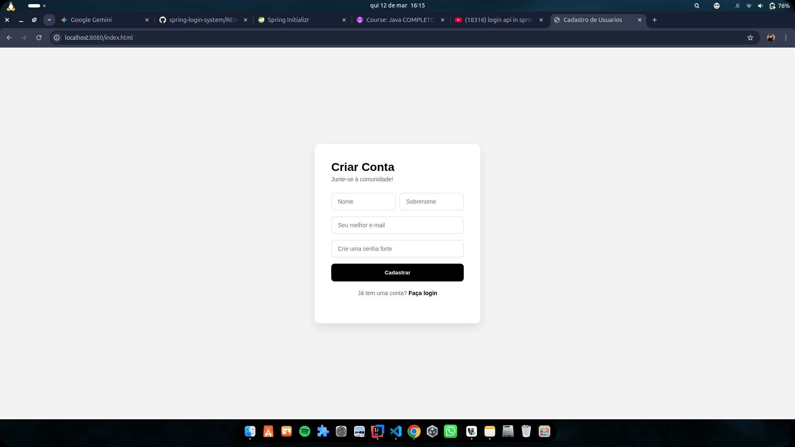
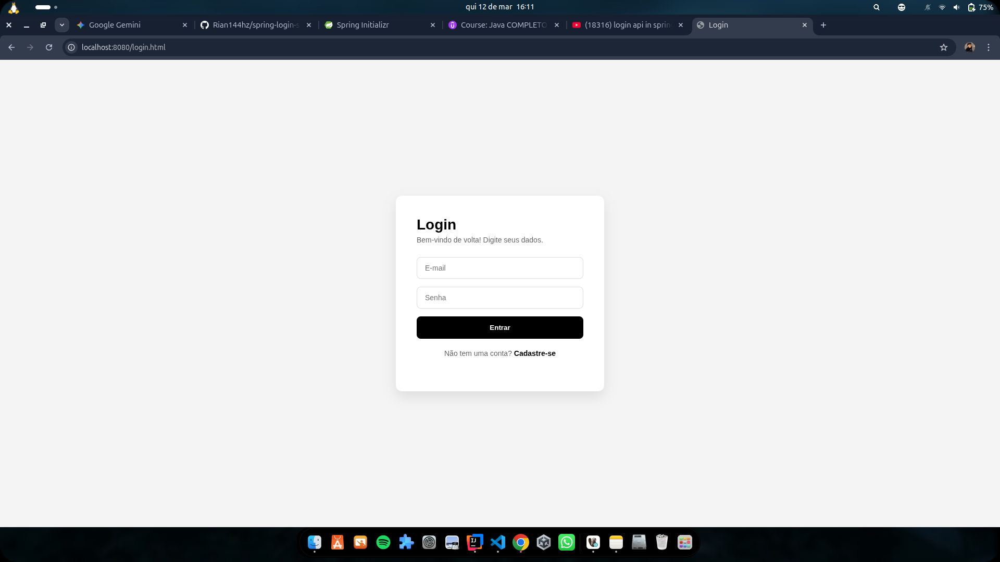

# 🚀 Spring Login System

Sistema de autenticação e gestão de usuários desenvolvido com **Java** e **Spring Boot**. O projeto implementa um fluxo completo de registro e login, com integração a uma base de dados **MySQL** e automação de build via **Gradle**.

---

## 🛠️ Tecnologias Utilizadas

* **Linguagem:** Java 21+
* **Framework:** Spring Boot 5.3.12 (Data JPA, Web)
* **Gerenciador de Dependências:** Gradle
* **Banco de Dados:** MySQL
* **Frontend:** HTML5, CSS3 e JavaScript (Fetch API)

---

## 📋 Funcionalidades

* **Registro de Usuários:** Captura de nome, sobrenome, e-mail e senha.
* **Persistência de Dados:** Mapeamento Objeto-Relacional (ORM) com Hibernate.
* **Autenticação:** Validação de credenciais diretamente na base de dados.
* **Interface Responsiva:** Telas limpas e intuitivas para o usuário.

---

## 📸 Demonstração


### Tela de Cadastro
Interface para novos usuários se juntarem à comunidade.


### Tela de Login
Acesso seguro ao sistema.


### Painel de Sucesso
Confirmação de autenticação bem-sucedida.


---

## 🚀 Como executar o projeto

1.  Clone o repositório:
    ```bash
    git clone [https://github.com/Rian144hz/spring-login-system.git](https://github.com/Rian144hz/spring-login-system.git)
    ```
2.  Configure o banco de dados no arquivo `application.properties`.
3.  Execute o projeto via terminal (Ubuntu):
    ```bash
    ./gradlew bootRun
    ```
4.  Acesse no navegador: `http://localhost:8080/index.html`

---
Desenvolvido por [Matheus Rian](https://github.com/Rian144hz) 👨‍💻
